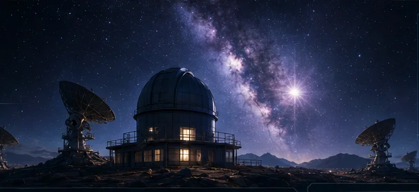
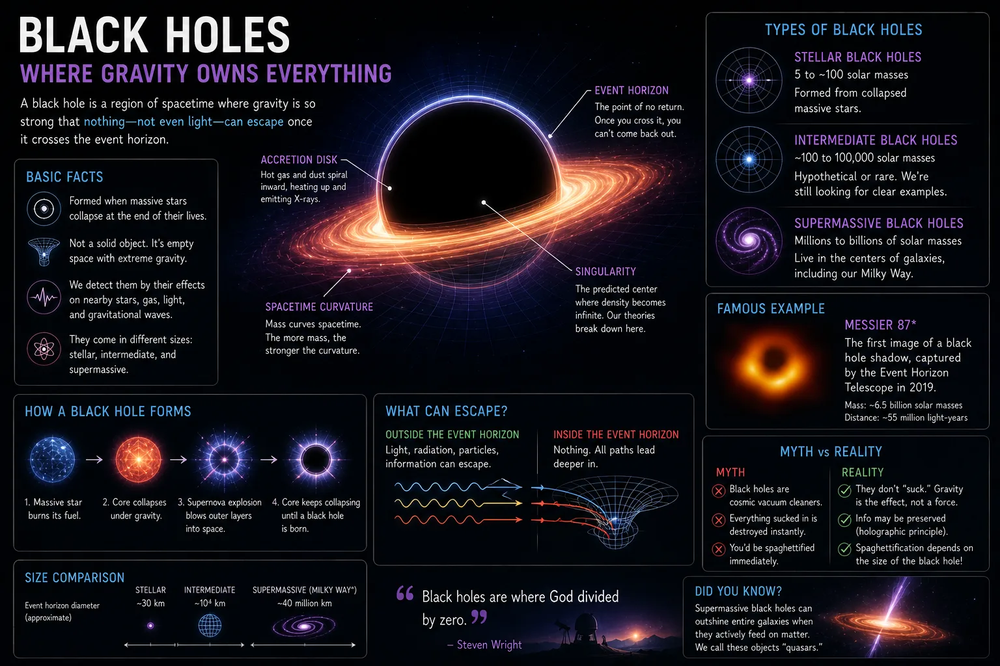
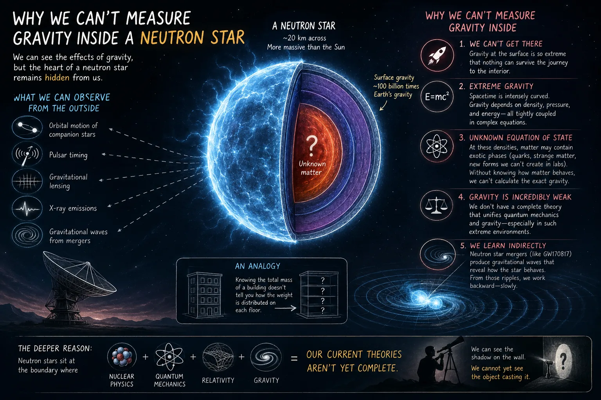
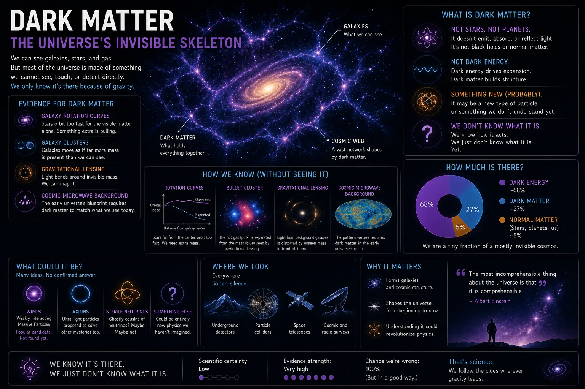
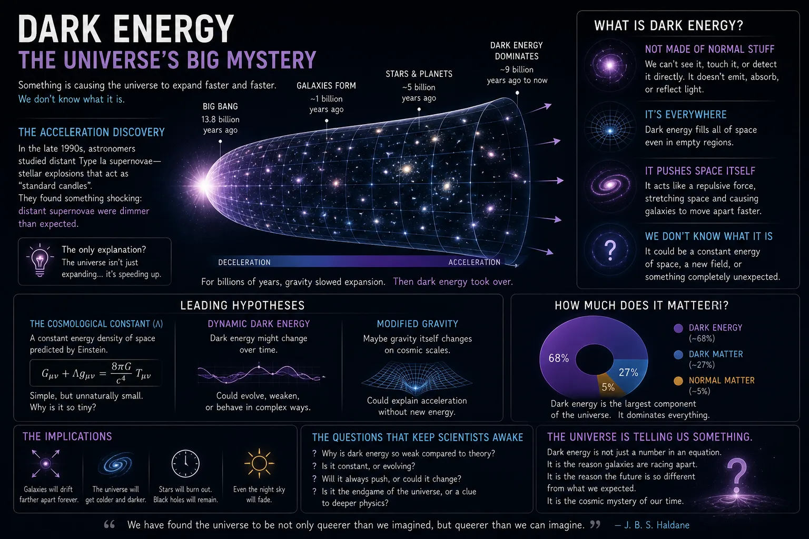
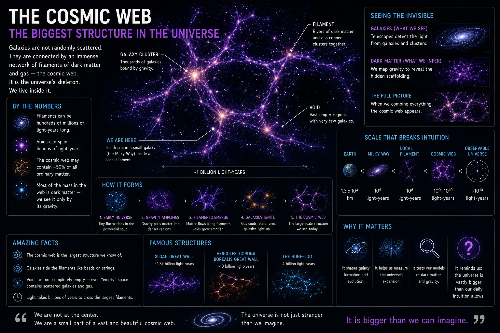
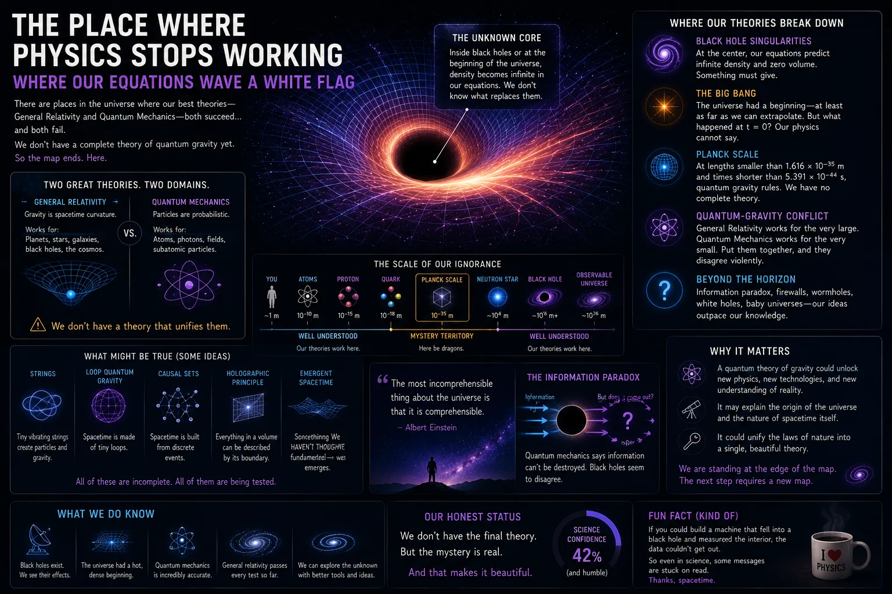

<div align="center">



# Where Physics Starts Sweating

### A field guide to the places where confident equations start using nervous punctuation.

[](https://astro.build)
[](#scientific-honesty-is-a-build-rule)
[](LICENSE)

**[Enter the observatory →](https://physics.nixfred.com)**

</div>

A cinematic, interactive field guide to the frontiers where modern physics
becomes uncertain, incomplete, or deeply weird. Real science, honestly labeled:
measured facts are cited, inferences are marked, speculation says so.

Live: **https://physics.nixfred.com**

> Physics knows a lot. The interesting part is where it starts sweating.

---

## The frontiers

Each field report starts with what has actually been measured, separates inference from observation, and labels the point where current models become uncertain.

<table>
<tr>
<td width="50%"><br><strong>Black holes</strong><br>The boundary where gravity hides the evidence.</td>
<td width="50%"><br><strong>Neutron-star interiors</strong><br>Matter compressed beyond laboratory reach.</td>
</tr>
<tr>
<td width="50%"><br><strong>Dark matter</strong><br>Gravity reveals something we still cannot identify.</td>
<td width="50%"><br><strong>Dark energy</strong><br>The expansion of the universe refuses to slow down.</td>
</tr>
<tr>
<td width="50%"><br><strong>The cosmic web</strong><br>Structure on scales too large to reproduce.</td>
<td width="50%"><br><strong>Where models break</strong><br>The seam between tested theory and honest uncertainty.</td>
</tr>
</table>

## Scientific honesty is a build rule

Every published article carries citations and classifies claims as `measured`, `inferred`, `model-dependent`, `hypothesis`, or `speculative`. A build-time citation check rejects published material with no sources or source URLs.

## Tech stack

- **[Astro](https://astro.build)** — static output, islands architecture (ships
  almost no JS; hydrates only the interactive bits).
- **React** islands — `StarfieldBackground`, `ConfidenceSlider`.
- **Tailwind CSS v4** (via `@tailwindcss/vite`) — design tokens in
  `src/styles/global.css`.
- **MDX** — article bodies.
- **Astro Content Collections + Zod** — the article content model, validated at
  build time.
- Deployed to **Cloudflare Pages** via **GitHub Actions** (`wrangler`).

## Folder structure

```
src/
  content/
    articles/            # one .mdx file per topic (the content)
  content.config.ts      # Zod schema for every article field (the contract)
  lib/articles.ts        # query helpers + derived Known Unknown score
  components/             # Astro + React UI components
  layouts/Layout.astro   # <head>, SEO/OG/structured data, starfield, reveal
  pages/
    index.astro          # the landing page
    articles/[slug].astro# article template (rich) + planned teaser template
    404.astro
  styles/global.css      # design tokens + shared utilities
public/
  assets/                # images you drop in (see public/assets/README.md)
scripts/
  check-citations.mjs    # build-time guard: published articles must be sourced
  new-article.mjs        # scaffold a new article stub
.github/workflows/deploy.yml
```

## How content works

Each article is one file in `src/content/articles/`, named `NN-slug.mdx`. The
YAML frontmatter is validated against the schema in `src/content.config.ts` — a
malformed or under-cited published article **fails the build** instead of
shipping broken.

Key fields: `title`, `subtitle`, `shortHook`, `longHook`, `status`
(`published` | `drafting` | `planned`), `order`, `heroImage`, `thumbnailImage`,
`themeColor`, `difficultyLevel`, `meters` (the Known Unknown Index),
`theoryStressNote`, `confidenceLevel`, `tags`, `summary`, `keyQuestions`,
`citations`, `relatedArticles`, `cluster`, and `station` (Observatory Mode).

The MDX body below the frontmatter is the article prose (used for `published`
articles; `planned` articles render a teaser from the frontmatter instead).

### Add a new article

```bash
bun run new:article "The Title Of The Piece"
# creates src/content/articles/NN-the-title-of-the-piece.mdx as a planned teaser
```

Then edit the file, drop a hero image in `public/assets/`, fill in the body, add
a `citations:` block, and set `status: published`.

### Mark article status

- `planned` — shows a styled "field report pending" teaser page.
- `drafting` — same teaser treatment; use while writing.
- `published` — renders the full MDX body and **requires citations**.

### Update the Known Unknown Index

Edit the `meters:` block (each 0–11; existential damage may exceed 10 on
purpose). The aggregate score shown on cards is **derived** from the meters in
`src/lib/articles.ts`, so it can never disagree with them.

### How citations work

Add entries to the `citations:` array. Each supports `id`, `title`, `author`,
`organization`, `url`, `dateAccessed`, `note`, `usedFor`, and a `badge`:

`measured` · `inferred` · `model-dependent` · `hypothesis` · `speculative`

`scripts/check-citations.mjs` runs before every build and fails if a `published`
article has no citations or no source URL.

### How image assets work

Drop files into `public/assets/` using the filenames articles reference (see
`public/assets/README.md`). Until a file exists, a styled placeholder slot shows
the expected filename. No code change needed to swap images in.

### Add an Observatory Mode station

Add a `station:` block to any article (`question`, `known`, `unknown`,
`continueLabel`). Stations are collected in order via `getStations()` in
`src/lib/articles.ts`, so each new article contributes one automatically.

## Run locally

```bash
bun install
bun run dev          # http://localhost:4321
```

## Build

```bash
bun run build        # runs the citation check, then builds to dist/
bun run preview      # serve the production build locally
```

## Deploy

### Automatic (default)

Push to `main`. GitHub Actions (`.github/workflows/deploy.yml`) builds and
deploys to the Cloudflare Pages project `physics` with `wrangler`. Requires two
repo secrets:

- `CLOUDFLARE_API_TOKEN`
- `CLOUDFLARE_ACCOUNT_ID`

### Manual

```bash
bunx wrangler pages deploy dist --project-name=physics
```

### Cloudflare Pages (Netlify alternative)

This is a standard static build, so Netlify works too: build command
`bun run build`, publish directory `dist`.

## Roadmap (post-MVP)

- **Observatory Mode** — immersive station-by-station guided descent (the data
  model is already in place via `station:` blocks).
- Auto-generated per-article Open Graph images.
- Full prose for articles 6–10.
- Optional React Three Fiber hero upgrade (gated on mobile performance).
